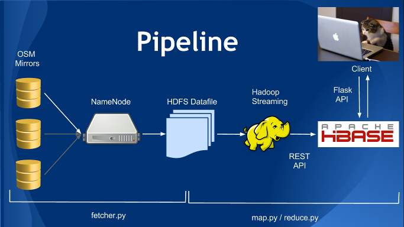
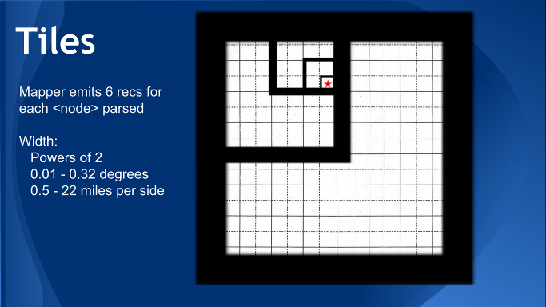

# Jaunt

## API for retrieving nearby amenities

Open Street Map mirror servers are polled in order of reliability and
the 35GB compressed XML file is pulled down and pushed into HDFS.

A Hadoop Streaming job is run to parse the XML file and insert location
data into HBase through the REST API. 

A Flask API serves API requests, pulling records from HBase as necessary
to find all nearby locations of a specific type.

## Map tiling scheme

The Earth is divided into tiles at 6 different resolutions. These are 
fixed, non-overlapping tiles ranging in size from 0.01 degrees to 0.32
degrees in width. The north-west corner of a tile must be aligned such
that CornerLat % TileWidth = 0 and CornerLon % TileWidth = 0.

The mapper must therefore determine all six tiles a location belongs to
and emit a record for each one. 

The reducer gathers together locations belonging on each tile, keeping
only the first 20, and inserts these into HBase.

## Cluster config

* 4-node cluster on AWS
* Cloudera v5.02
* HBase 0.96

### Additional software on master node

> `$ sudo apt-get install python-pip expect-dev`  
> `$ sudo pip install starbase flask urllib2`

## Scripts

* fetcher.py should be scheduled to run in cron weekly
* Launch API with `python api-svr.py >> /var/log/jaunt-api.log`
